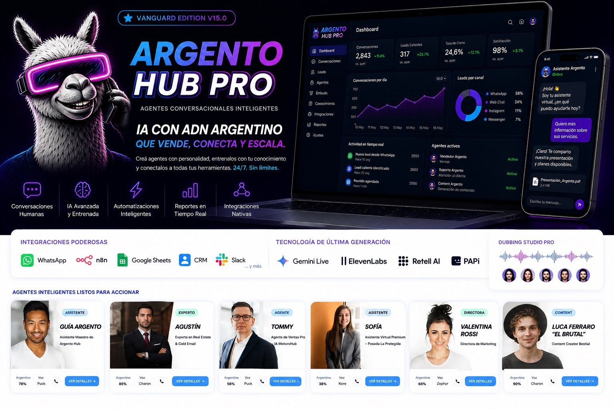
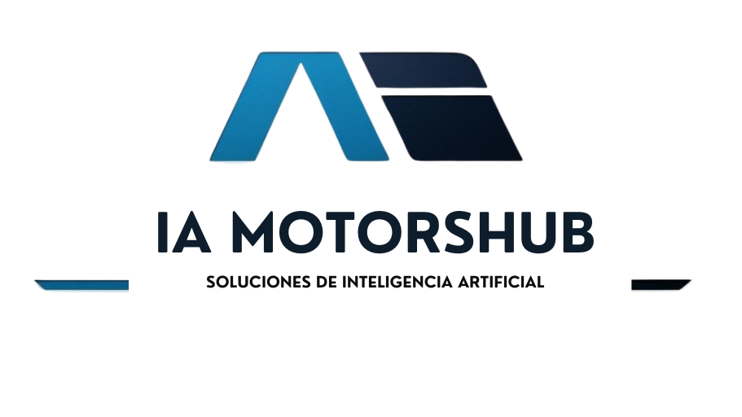
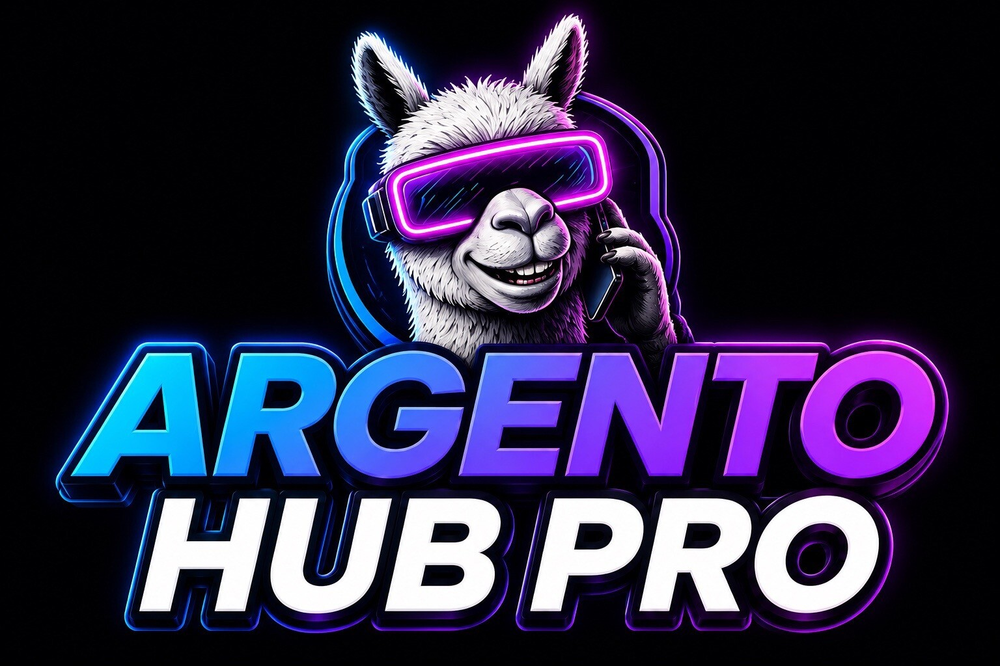
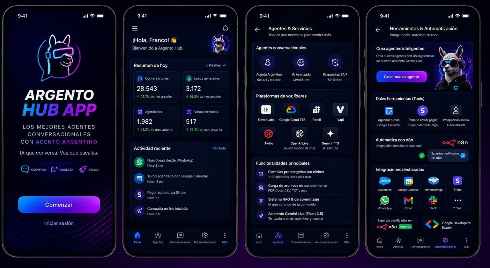
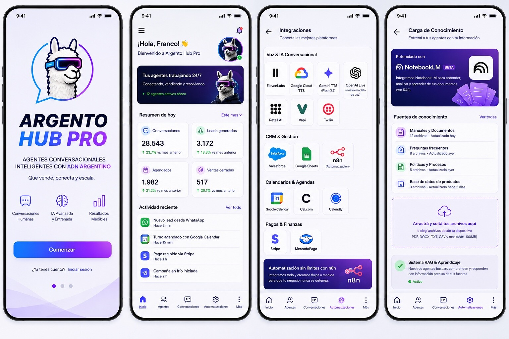
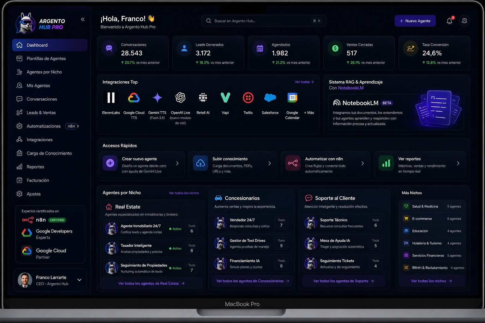
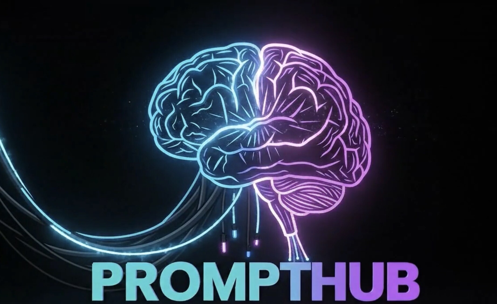

# IA MOTORSHUB OS — Visual Brand Kit

> **North star:** tecnología premium, humana y accionable. IA MOTORSHUB es el ecosistema; **Argento Hub** es su producto insignia.

## 1. Arquitectura de marca

| Nivel | Marca | Función | Firma visual |
|---|---|---|---|
| **Masterbrand** | IA MOTORSHUB | Empresa, ecosistema y sello institucional | Azul profundo, cian, platino; sobria y ejecutiva |
| **Producto principal** | Argento Hub | Plataforma de agentes conversacionales | Negro tinta, azul eléctrico, violeta; llama con visor |
| **Productos del ecosistema** | PromptHub y futuros hubs | Módulos especializados conectados al OS | Heredan el sistema cromático y suman un símbolo propio |

La masterbrand respalda; el producto protagoniza. En una pieza comercial de Argento Hub, la llama puede ocupar el centro y **IA MOTORSHUB** funciona como firma: “An IA MOTORSHUB company/product”. No deben competir al mismo tamaño.

## 2. Identidad maestra

### Uso

- Presentaciones corporativas, documentos legales, propuestas B2B e institucionales.
- Preferir fondos blancos, platinum o azul noche uniforme.
- Mantener un área libre mínima equivalente a la altura de la letra **I** alrededor del conjunto.
- Nunca sumar glow violeta al logo corporativo: el glow pertenece al universo de producto.

## 3. Argento Hub — identidad de producto

### Activos reconocibles

1. **La llama:** inteligencia con personalidad, cercanía y ADN argentino.
2. **El visor:** capa tecnológica; cian y magenta son luz, no decoración gratuita.
3. **El gradiente:** comunica conexión entre voz, datos, automatización y acción.
4. **El negro tinta:** sostiene el contraste y evita una estética infantil.

### Tono visual

- Premium, cinematográfico, preciso y con energía comercial.
- Realista o 3D pulido para campañas; lineal/minimalista para iconos de interfaz.
- Nunca cyberpunk caótico, gamer genérico, caricatura infantil ni “robot azul de banco”.
- El personaje acompaña la función: vende, atiende, agenda o analiza. No aparece porque sí.

## 4. Paleta oficial

| Token | HEX | Uso principal |
|---|---:|---|
| **Ink 950** | `#040712` | Fondo premium y superficies hero |
| **Navy 900** | `#081228` | Sidebars, cards oscuras, overlays |
| **Argento Blue** | `#246BFD` | Acciones, navegación, datos |
| **Electric Cyan** | `#00B7FF` | Foco, voz, conexión, highlights |
| **Violet** | `#7C3AED` | Agentes, automatización, profundidad |
| **Neon Magenta** | `#E000FF` | Acento excepcional y energía de campaña |
| **Platinum** | `#E8ECF4` | Fondos claros y superficies secundarias |
| **White** | `#FFFFFF` | Texto principal sobre oscuro |
| **Success** | `#22C55E` | Estados activos y resultados positivos |

**Gradiente insignia:** `linear-gradient(110deg, #00B7FF 0%, #246BFD 42%, #7C3AED 72%, #E000FF 100%)`.

El magenta se usa como remate, no como pintura de pared. El verde queda reservado a estados y métricas. **No usar dorado:** pertenecía a una dirección visual anterior y rompe la consistencia actual.

## 5. Tipografía

| Rol | Familia | Peso | Regla |
|---|---|---:|---|
| Display / Hero | **Montserrat** | 800–900 | Mayúsculas selectivas, tracking compacto |
| Títulos UI | **Inter** | 600–700 | Claridad antes que espectáculo |
| Cuerpo / labels | **Inter** | 400–500 | Lectura rápida, contraste AA |
| Métricas | **Inter** | 700–800 | Números grandes y tabulares cuando sea posible |

La cursiva puede enfatizar una palabra de campaña, nunca un párrafo entero. Evitar más de dos familias tipográficas en una misma experiencia.

## 6. Sistema de interfaz

### Dark mode — experiencia insignia

- Es el modo principal para marketing, demos de alto impacto y dashboards ejecutivos.
- Cards Navy 900 sobre Ink 950, bordes blancos al 8–12% y glow sólo en foco activo.
- Radio recomendado: 12–16 px en cards; botones pill sólo para CTAs o estados.

### Light mode — operación y legibilidad

- Ideal para carga de conocimiento, formularios, tablas extensas y tareas diarias.
- Fondo blanco/platinum, tinta azul noche y gradiente reservado a CTAs y banners.
- No convertir el modo claro en una copia desaturada del oscuro: debe respirar.

### Desktop — densidad con jerarquía

- Orden de lectura: contexto → KPIs → actividad → acciones → detalle.
- Una sola acción primaria por viewport.
- Las visualizaciones usan azul/violeta como serie principal; verde sólo para mejora real.
- Reducir el glow dentro de zonas de alta densidad: si todo brilla, nada importa.

## 7. Fotografía, 3D y mockups

- Para portada: composición 16:9 o 21:9 con personaje, producto y prueba funcional.
- Para portfolio: un hero potente + una vista desktop + una secuencia mobile clara/oscura.
- Los dispositivos deben mostrar pantallas coherentes entre sí, con métricas, nombres y navegación consistentes.
- No deformar iPhone/MacBook, mezclar marcos de distintas generaciones ni usar UI ilegible sólo para llenar.
- Mantener respiración alrededor de logos; el mockup vende la experiencia, no tapa la marca.

## 8. Ecosistema de productos

Los productos satélite heredan **Ink + Cyan + Violet**, la tipografía y el lenguaje de conexión. Cada uno puede sumar una metáfora visual propia —por ejemplo, cerebro/cableado para PromptHub— sin inventar una paleta completamente nueva.

## 9. Movimiento

- Entrada de marca: 500–700 ms, `cubic-bezier(0.22, 1, 0.36, 1)`.
- Hover de cards: elevación de 2–4 px y borde eléctrico; sin saltos bruscos.
- Métricas: conteo corto, máximo 1.2 s.
- Llama: microgestos humanos, mirada y respiración; nada de correr por pasillos como dibujito.
- Fondos: ondas, grillas o partículas muy sutiles. El movimiento guía, no distrae.

## 10. Voz de marca

**Clara, argentina, segura y orientada a resultados.** Hablamos como expertos que entienden el negocio, no como un laboratorio enamorado de sus siglas.

### Sí

- “IA con ADN argentino que vende, conecta y escala.”
- “Tus agentes trabajando 24/7.”
- “Conversaciones humanas. Resultados medibles.”

### No

- Promesas absolutas sin evidencia.
- Jerga técnica como titular principal.
- Exceso de lunfardo o humor en contextos corporativos.

## 11. Checklist de aprobación

- [ ] ¿Se entiende en tres segundos qué marca habla y qué producto se muestra?
- [ ] ¿La llama cumple una función dentro de la pieza?
- [ ] ¿El gradiente está concentrado en foco, CTA o identidad?
- [ ] ¿Los textos mantienen contraste y legibilidad real?
- [ ] ¿Las métricas y pantallas son coherentes entre dispositivos?
- [ ] ¿IA MOTORSHUB respalda sin competir con Argento Hub?
- [ ] ¿La pieza se siente premium antes que “tecnológica porque sí”?

---

**Decisión visual vigente:** azul eléctrico + violeta sobre negro tinta, con platinum para operación clara. La llama es el activo distintivo de Argento Hub; IA MOTORSHUB conserva el rol institucional del ecosistema.
